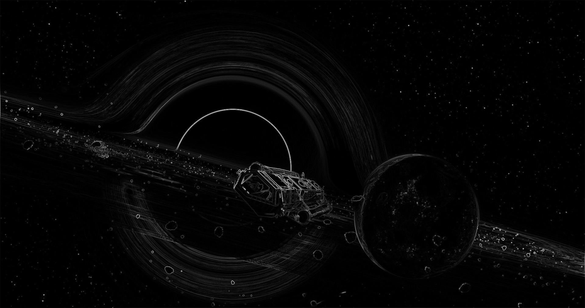

# Fancy Things - Image Processing Tool




<!--  -->
<!--  -->
<!--  -->

**Fancy Things** is my personal pet project exploring modern C++ and real-time image processing. 
Developed as a learning experiment, it combines computer graphics fundamentals with hands-on system design.

## Project Origins

This application began as a project to:
- Understand low-level image manipulation
- Implement filter algorithms
- Improve my CMake and C++ skills

_While not enterprise-grade, it serves as a demonstration of core concepts I interested in._

## Features

- **Real-time Filter Previews**: See changes instantly
- **Multiple Filters**:
  - Blurs (Box, Gaussian, Motion)
  - Edge Detection (Sobel, Laplacian)
  - Special Effects (Embossing)
- **Image Saving**: Save processed images at any time
<!-- - **Cross-platform**: Works on Windows/Linux/macOS -->

## Requirements

- **Compiler**: GCC 11+ or Clang 14+
- **CMake**: 3.21+
- **SFML**: 2.6+
- **spdlog**: 1.15+

## Installation

```bash
# Clone repository
git clone https://github.com/fogInSingularity/fancy_things
cd fancy_things

# Build
cmake -S . -B build -DCMAKE_BUILD_TYPE=Release
cmake --build build --parallel `nproc`
```

## Usage

```bash
./build/fancy_things image.png
```

**Hotkeys:**
- `Q`: Quit application
- `A`: Apply selected filter
- `S`: Save processed image

## Supported filters

| Filter                         | Description                         |
|--------------------------------|-------------------------------------|
| Box blur                       | Simple "average" blur               |
| Gaussian blur                  | Soft blur using normal distribution |
| Motion blur                    | Directional blur                    |
| Sobel/Laplacian edge detection | Edge detection                      |
| Embossing                      | 3D relief effect                    | 

## Project progress

[Development timeline](./DEV_TIMELINE.md)
